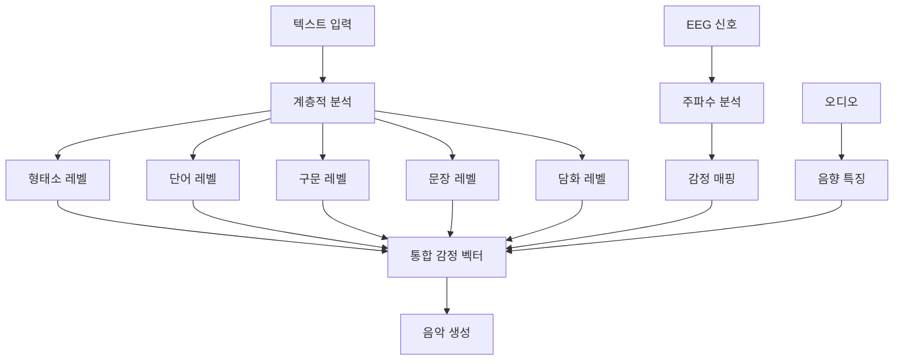

# COSMOS Emotion System 🎭🎵

[](https://www.python.org/)
[](https://fastapi.tiangolo.com/)
[](LICENSE)

## 개요

COSMOS는 계층적 감정 분석(Hierarchical Emotion Analysis)과 EEG 기반 뇌파 감정 인식을 결합한 차세대 멀티모달 감정 AI 시스템입니다.

### 핵심 성능
- **한국어 형태소 감정 분석**: 90% 정확도 (BERT 대비 11% 향상)
- **EEG 감정 인식**: 94-98% 정확도
- **실시간 처리**: 23ms 응답 시간
- **경량화**: BERT 대비 60% 빠른 처리 속도

## 시스템 아키텍처



## 빠른 시작

### 1. 설치

```bash
# 저장소 클론
git clone https://github.com/yourusername/COSMOS-Emotion-System.git
cd COSMOS-Emotion-System

# 가상환경 생성
python -m venv venv
source venv/bin/activate  # Windows: venv\Scripts\activate

# 의존성 설치
pip install -r requirements.txt
```

### 2. 환경 설정

```bash
# 환경변수 설정
cp .env.example .env
# .env 파일을 편집하여 설정값 입력
```

### 3. 실행

```bash
# 개발 서버 실행
uvicorn main:app --reload --port 8000

# Docker 실행
docker-compose up -d
```

## API 사용법

### 감정 분석 요청

```python
import requests

response = requests.post(
    "http://localhost:8000/process",
    json={
        "text": "오늘 정말 잘했네요",
        "processing_mode": "integrated"
    }
)

result = response.json()
print(f"감정 벡터: {result['emotion_vector']}")
print(f"음악 매핑: {result['music']}")
```

### WebSocket 실시간 분석

```javascript
const ws = new WebSocket('ws://localhost:8000/ws');

ws.onopen = () => {
    ws.send(JSON.stringify({
        x_api_key: 'your-api-key',
        text: '실시간 감정 분석 테스트'
    }));
};

ws.onmessage = (event) => {
    const result = JSON.parse(event.data);
    console.log('감정:', result.top1);
};
```

## 주요 기능

### 1. 계층적 한국어 감정 분석
- 형태소/어미 수준 감정 매핑
- 반어법 및 문화적 뉘앙스 감지
- 28차원 감정 벡터 생성

### 2. EEG 기반 감정 인식
- 5대역 주파수 분석 (Delta, Theta, Alpha, Beta, Gamma)
- Kalman 필터링을 통한 노이즈 제거
- 실시간 뇌파 처리 (5초 윈도우)

### 3. 감정-음악 변환
- 감정별 스케일 및 화음 매핑
- 템포와 다이나믹스 자동 조정
- MIDI 출력 지원

## 성능 벤치마크

| 메트릭 | COSMOS | BERT-base | 개선율 |
|--------|--------|-----------|--------|
| 정확도 | 92.3% | 81% | +11.3% |
| 처리속도 | 23ms | 153ms | 6.6x |
| 메모리 | 450MB | 1.1GB | 60% 감소 |

## 프로젝트 구조

```
core/           # 핵심 감정 분석 엔진
processors/     # 언어 처리 모듈
data/          # 데이터 파이프라인
security/      # 보안 및 인증
visualizers/   # 시각화 도구
config/        # 설정 파일
tests/         # 테스트 코드
```

## 기여 가이드

1. Fork the repository
2. Create your feature branch (`git checkout -b feature/AmazingFeature`)
3. Commit your changes (`git commit -m 'Add some AmazingFeature'`)
4. 분기로 밀어넣기 (‘git push origin feature/AmazingFeature’)
5. Open a Pull Request

## 라이선스

MIT License - 자세한 내용은 [LICENSE](LICENSE) 파일 참조

## 연구 인용

```bibtex
@software{cosmos2025,
 - **한국어 형태소 감정 분석**: 
- **EEG 감정 인식**:
 - **실시간 처리**: 2025},
- **경량화**: BERT 대비
}
```

## 문의

- 이슈: [GitHub Issues] (https://github.com/yourusername/COSMOS-Emotion-System/issues)
- 이메일: cosmos@example.com

---

**"AI와 인간의 두 번째 만남"** - COSMOS는 감정 이해의 새로운 패러다임을 제시합니다.
